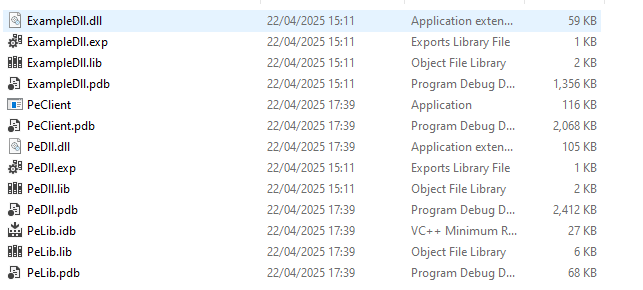
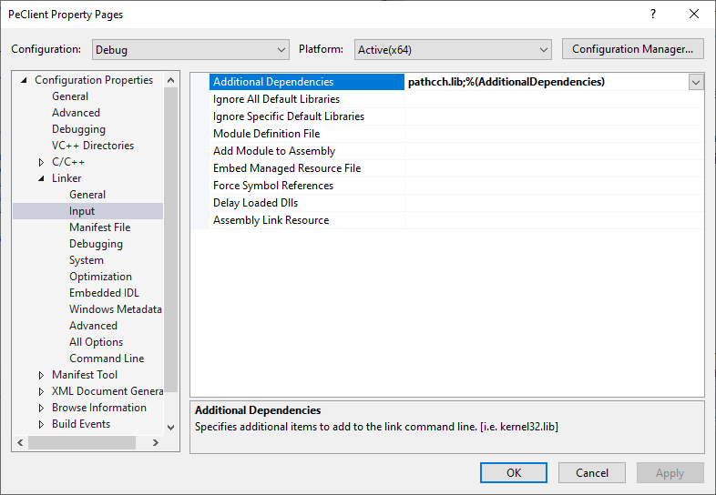
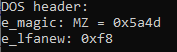

# DOS header
The very first section of the PE file is the DOS header. The DOS header is a 64-byte structure, described by the `_IMAGE_DOS_HEADER` structure definition in winnt.h. Let's try and read this structure from the file.

## Reading the DOS header
We declare a function `read_dos_header` which takes pointer to a `FILE`, and returns an `_IMAGE_DOS_HEADER` structure. The function:
1. seeks to the beginning of the file;
1. reads a number of bytes equal to the size of `_IMAGE_DOS_HEADER` directly into a buffer.

To allow us to seek, we create a slightly more robust wrapper for [`fseek`](https://learn.microsoft.com/en-us/cpp/c-runtime-library/reference/fseek-fseeki64?view=msvc-170), `utils::safe_seek`. A problem with `fseek` is that it does not fail if attempting to seek beyond the end of the file; `safe_seek` guards against this and throws an exception if attempted.

We read the bytes with [`fread_s`](https://learn.microsoft.com/en-us/cpp/c-runtime-library/reference/fread-s?view=msvc-170), which is a more secure version of [`fread`](https://learn.microsoft.com/en-us/cpp/c-runtime-library/reference/fread?view=msvc-170). If it fails, `read_dos_header` throws.

(Note, it would be more modern practice to do this using a filestream rather than using the older C-style methods for file handling, but it's OK for our purposes).

## Exploring the file 
The function `explore::explore` is where we will open the ExampleDll.dll file and then call some helper functions to explore each part in turn. Opening the file actually presents a little challenge, as we need to pass *the path to this file* as an argument to [`fopen_s`](https://learn.microsoft.com/en-us/cpp/c-runtime-library/reference/fopen-s-wfopen-s?view=msvc-170) (which is a secure version of [`fopen`](https://learn.microsoft.com/en-us/cpp/c-runtime-library/reference/fopen-wfopen?view=msvc-170)).
The ExampleDll appears in the same build directory as the application executable:\
\
This gives us a strategy for getting the full path of ExampleDll:
1. have the executable get the full path of itself, i.e. the exectuable file of the current process;
1. strip the filename from the path;
1. append with the name of another file (e.g. ExampleDll.dll).

### Building an absolute path to a file next to the executable
To do this, we create a little utility function `app_utils::_get_abs_path_from_filename` to do this for any given file name. This achieves the steps above using three Windows functions:
1. [`GetModuleFileName`](https://learn.microsoft.com/en-us/windows/win32/api/libloaderapi/nf-libloaderapi-getmodulefilenamew) retrieves the fully qualified path for the file that contains the specified module. If the first parameter is NULL, it retrieves the path of the executable file of the current process, which is what we want.
1. [`PathCchRemoveFileSpec`](https://learn.microsoft.com/en-us/windows/win32/api/pathcch/nf-pathcch-pathcchremovefilespec) removes the last element in a path string, whether that element is a file name or a directory name. The element's leading backslash is also removed.
1. [`PathCchAppend`](https://learn.microsoft.com/en-us/windows/win32/api/pathcch/nf-pathcch-pathcchappend) appends one path to the end of another.

Note that the last two functions are defined in the static library pathcch.lib, so we must add this as a linker input to PeClient.

Phew!

### Reading the DOS header
The function `explore::explore` opens the file before calling `explore::explore_dos_header`. There is one wrinkle to opening the file:`get_abs_path_from_filename` puts the path into a `WCHAR` buffer, but `f_opens` expects the path in a `char` buffer; to handle this, we define a little conversion function `app_utils::wchar_t_buffer_to_string`. This function follows the [process for converting between string types outlined on MS learn](https://learn.microsoft.com/en-us/cpp/text/how-to-convert-between-various-string-types?view=msvc-170).

Finally, `explore::explore_dos_header` calls `read_dos_header`, and prints the only two values that are of real interest: the magic number and the offset to the start of the Windows NT headers.

