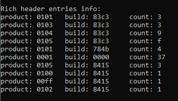

# DOS stub and Rich header
## DOS stub
This one is easy, as it's just a set of bytes between the DOS header and the start of the Windows NT headers; we know the size of the DOS header (64 bytes) and the `e_lfanew` member of the `_IMAGE_DOS_HEADER` gives us the offset to the start of the Windows NT headers, so all `read_dos_stub` does is read the bytes between these two offsets into a buffer, and return the number of bytes read. Note, these bytes will include the DOS program section of the stub (i.e. the bit that usually prints *This program cannot be run in DOS mode.*), but also the raw Rich header bytes which lie at the end of the stub. That's because, as far as I know, the program part of the DOS stub needn't necessarily be a standard size, so we can't easily work out which bytes to trim off the end if we just want the program part. In the next section, we'll see how to find the start of the Rich header bytes; we could have used this logic here to calculate which bytes to trim, but it feels like a needless complication. What you can always do is read both the DOS stub and the Rich header, and subtract the length of the Rich header from that of the DOS stub to get the length of the DOS program.

In `explore_dos_header`, we dump the bytes to the console, both as ASCII and hex values. To help with this, `app_utils` includes the function `dump_bytes`, which prints  a vector of bytes to the console in lines of 16 bytes (together with the starting offset for each line), in either ASCII or hex. When printing ASCII, we have to be careful as some values convert to non-printable ASCII characters e.g. printing a carriage return actually causes a carriage return, which is not what we want. To workaround this, the ASCII option checks if a character is printable using `isprint`, and if not simply prints its hex value anyway.


### Inspecting the DOS stub
The first set of bytes is the DOS program, which starts with bytes 0e, 1f, and we can see includes the ASCII string *This program cannot be run in DOS mode.*. Shortly after this, there are some trailing zero bytes, followed by another set of nonzero bytes. Somewhere in this second set of bytes is the mysterious Rich header, followed by some trailing padding zero bytes. An excellent source of information about the Rich header is [Rich Header Research](https://github.com/RichHeaderResearch/RichPE?tab=readme-ov-file).

## Rich header
The Rich header ends with (in ASCII) the `Rich` marker, followed by a four-byte XOR key, which for our example happen to be 2b 35 a9 81. The header is decrypted by XORing each group of four bytes with the four-byte XOR key. The start of the header is marked by the `DanS` string.

The function `read_rich_header` reads the full DOS stub bytes, then searches from the end until the `Rich` marker is found, and hence the XOR key in the following bytes. It then continues iterating backwards through the encrypted bytes, XORing each byte with the appropriate byte of the XOR key (the byte immediately before the `Rich` marker is XORed with the final byte of the key) to reveal plaintext bytes. The iteration continues until the `DanS` marker is hit in the plaintext.

The resulting decrypted bytes (between the `DanS` and `Rich` markers) represent a series of entries which give information about a particular product used in the production of the PE file, where each entry is represented by two `WORD`s and a `DWORD`, which are respectively, the build, product and count. The final part of the function parses these bytes into a vector of the `RICH_HEADER_ENTRY` structure, defined as: 
```C++
struct RICH_HEADER_ENTRY
{
    WORD product;
    WORD build;
    DWORD count;
};
```

We can use `explore_rich_header` to pretty print the results for our ExampleDll.dll:

.

With the help of a lookup table such as [this one](https://github.com/dishather/richprint/blob/master/comp_id.txt) we can look up the coresponding product and builds: for example, product 0105 build 8415 is listed as  [C++] VS2022 v17.10.5 build 33813.